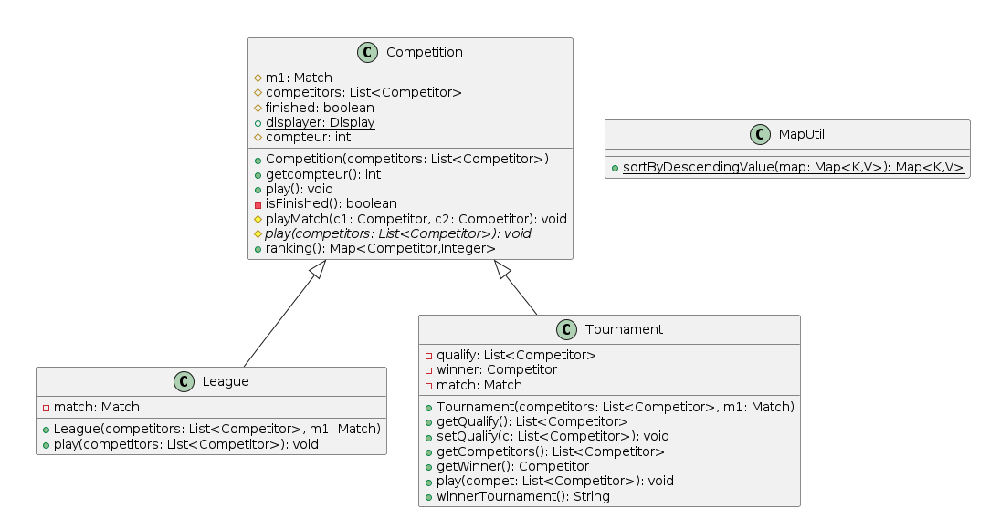
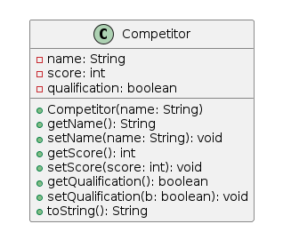
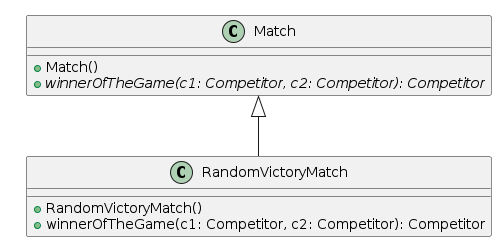
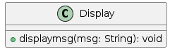
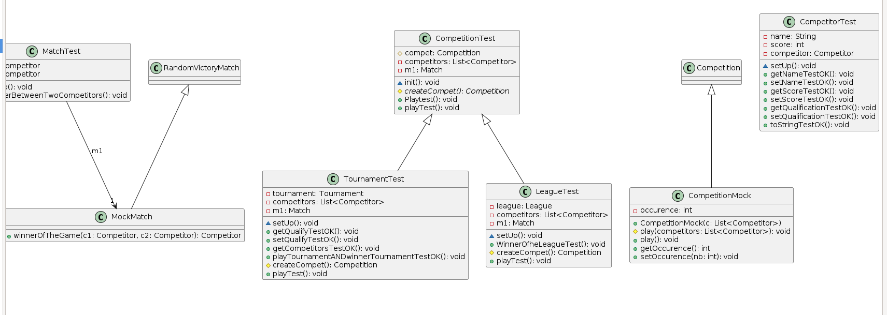
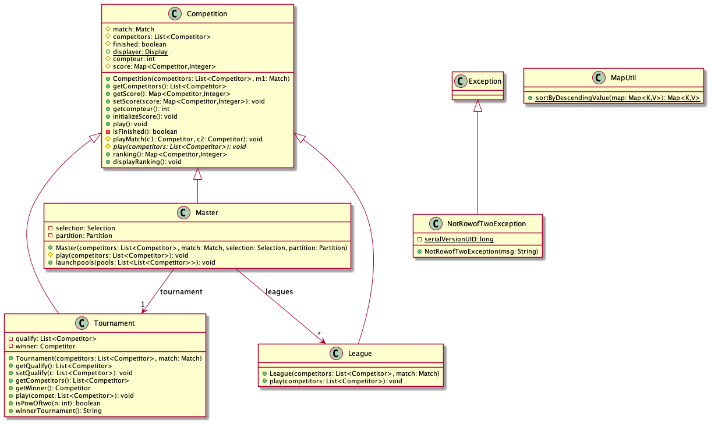
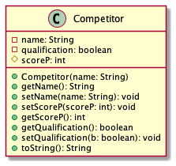
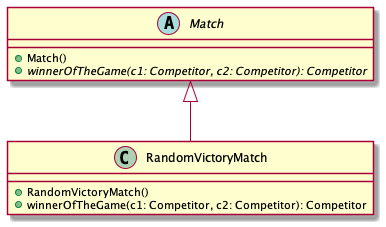
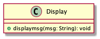
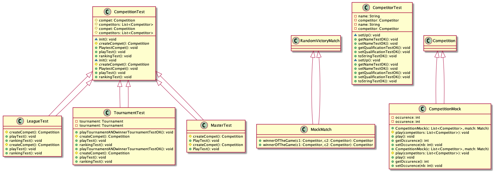

# l3-s3-projet-2023

# Equipe
- Amadou Barro
- Nathan Guerrit
- Mohamed Hamza Benboubker

# [Le sujet] (http://www.fil.univ-lille.fr/~quinton/coo/projet/competitions.pdf)

# Livrables

## Semaine 1

Durant cette semaine, on s'était fixé comme objectifs de : réaliser les deux
classes suivantes : *League* && *Tournament* et les *Tests Unitaires* de chaque classe.  
- Je (Amadou Barro) me suis occupé de coder la classe **League** et de tester
la méthode *play*;
- Nathan s'est chargé de coder la classe **Tournament** et de la tester

## Semaine 2
- Nous avons finaliser les tests
- Génerer et éxécuter l'archive
- Génerer les diagrammes UML

## Rendu Livrable 1

## Semaine 1 

Nous avons chacun modifier/corriger les remarques sur notre livrable 1 et nous avons réfléchi à comment implémenter la nouvelle competition Master.

## Semaine 2

Amadou et Hamza ont implémenté Master dans compétition avec toutes les méthodes qui vont avec , Nathan s'est occupé de faire Partition qui
est la méthode de création des groupes.

## Semaine 3 

Amadou a créer la base de Sélection,a créer une méthode de séléction et s'est occupé de tout le display de Master. 
Nathan a créer 3 méthodes de sélection et a gérer le rank final de Master notamment la gestion des points.
Hamza a également créer une méthode de sélection  et s'est occupé de toute la partie test pour Master.

## HowTo

Pour éxécuter ces commandes , se placer dans le repertoir *l3s5-projet-2023.

**Compiler les classes (par défaut via eclipse) :**

- javac -classpath src -d bin src/main/MainCompet.java

**génération de la documentation :**

-  javadoc -classpath src -d docs -subpackages competition selection 

**compilation des tests :**

- javac -classpath test4poo.jar test/*.java 

**Exécution des tests :**

- java -jar test4poo.jar SomeClassTest (nom de la classe de test.java)

**Création du Jar :**

- jar cvfe compet.jar main.MainCompet -C bin

**Execution du Jar :**

- java -jar compet.jar 

## Diagramme UML verion 1

## Diagramme UML version 2 

