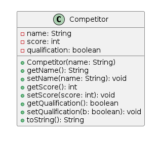
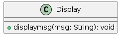
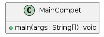
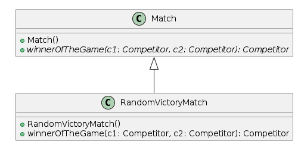

# l3-s3-projet-2023

# Equipe
- Amadou Barro
- Nathan Guerrit
- Mohamed Hamza Benboubker

# [Le sujet] (http://www.fil.univ-lille.fr/~quinton/coo/projet/competitions.pdf)

# Livrables

## Semaine 1

Durant cette semaine, on s'était fixé comme objectifs de : réaliser les deux
classes suivantes : *League* && *Tournament* et les *Tests Unitaires* de chaque classe.  
- Je (Amadou Barro) me suis occupé de coder la classe **League** et de tester
la méthode *play*;
- Nathan s'est chargé de coder la classe **Tournament** et de la tester

## Semaine 2
- Nous avons finaliser les tests
- Génerer et éxécuter l'archive
- Génerer les diagrammes UML

## HowTo

Pour éxécuter ces commandes , se placer dans le repertoir *l3s5-projet-2023.

**Compiler les classes (par défaut via eclipse) :**

- javac -classpath src -d bin src/main/MainCompet.java

**génération de la documentation :**

-  javadoc -classpath src -d docs -subpackages pack1 pack2

**compilation des tests :**

- javac -classpath test4poo.jar test/*.java 

**Exécution des tests :**

- java -jar test4poo.jar SomeClassTest

**Création du Jar :**

- jar cvfe compet.jar main.MainCompet -C bin

**Execution du Jar :**

- java -jar compet.jar 

## Diagramme UML

