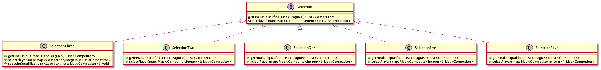

# l3-s3-projet-2023

# Equipe
- Amadou Barro
- Nathan Guerrit
- Mohamed Hamza Benboubker

# [Le sujet] (http://www.fil.univ-lille.fr/~quinton/coo/projet/competitions.pdf)

# Elements de Conception

##### Compte rendu Livrable 1

Toutes les compétitions héritent de la classe abstraite Competition et ne redefinissent qu'une seule méthode abstraite qui est play(List<Competitor>).Cette méthode joue un rôle important car elle permet à toutes les classes qui héritent de compettions de préciser la modalité de déroulement de sa competition.
Etant donné que c'est la seule méthode qui différencie les classes filles , nous sommes à la présence d'une **Template method**.
Nous avons aussi ajouter un Displayer pour nous permettre d'afficher toutes les actions effectuées : le classement , les gagnants d'un match.

##### Compte rendu Livrable 2

Dans cette nouvelle version, nous devons ajouter une nouvelle type de compétition appelé **Master**. Cette compétitiion se joue en deux phases:
- Une phase de poule
- Une phase finale.

la difficulté consisté à trouver comment sélectionner le nomnbre de compétiteurs puvant accéder à la phase finale tout en respectant les principes **SOLID**. Pour ce faire nous avons utilisé le *Design Pattern Strategy*, De cette maniére nous pourrons créer plusieurs méthodes de Selection et de Partitionnement sans devoir effectuer beaucoup de modifications.

## HowTo

Pour éxécuter ces commandes , se placer dans le repertoir *l3s5-projet-2023.

**Compiler les classes (par défaut via eclipse) :**

- javac -classpath src -d bin src/main/MainCompet.java

**génération de la documentation :**

-  javadoc -classpath src -d docs -subpackages competition
selection 

**compilation des tests :**

- javac -classpath test4poo.jar tests/*.java 

**Exécution des tests :**

- java -jar test4poo.jar SomeClassTest (nom de la classe de test.java)

**Création du Jar :**

- jar cvfe compet.jar main.MainCompet -C bin

**Execution du Jar :**

- java -jar compet.jar 

## Diagramme UML version 2 

